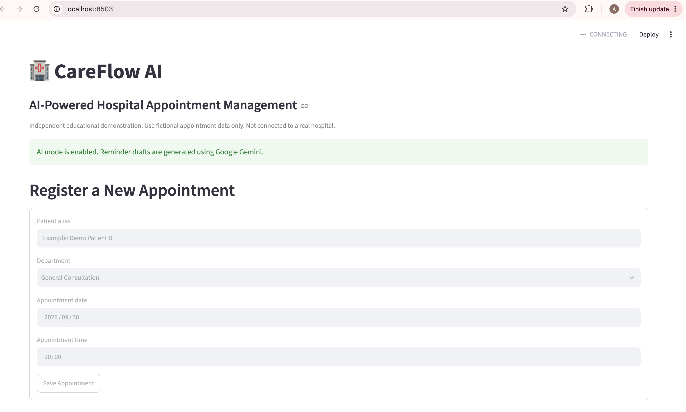
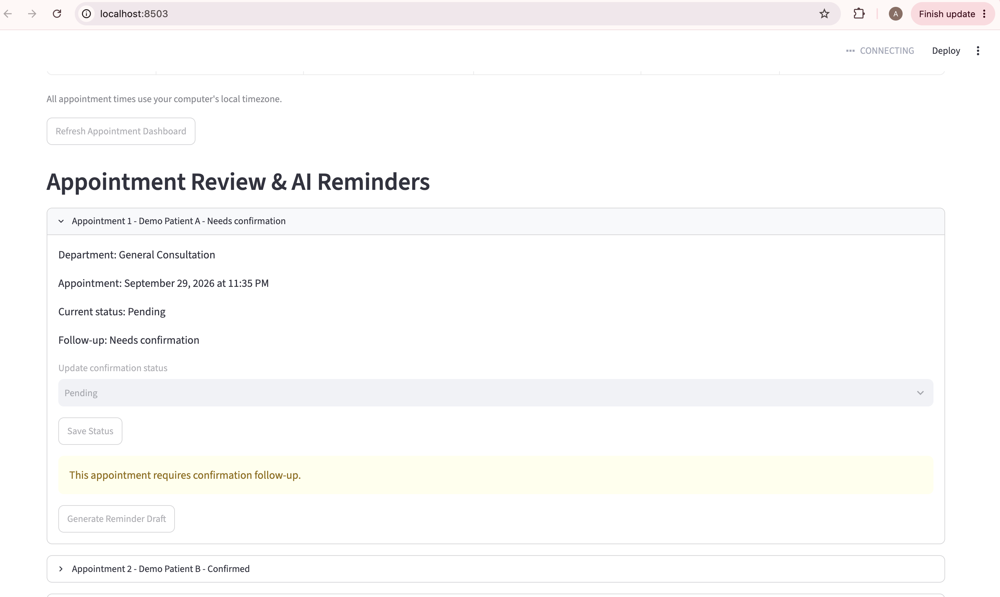
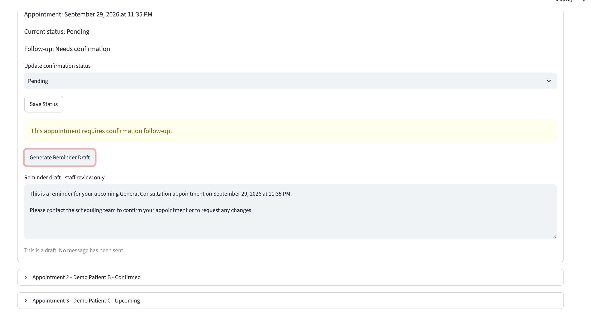

# CareFlow AI


## Live Application

🚀 **[Launch CareFlow AI](https://careflow-ai-hospital-appointment-management-rj5wgpjun4pfaehict.streamlit.app)**

CareFlow AI is deployed on Streamlit Community Cloud and can be tested using synthetic appointment data.

## Application Screenshots

### Appointment Dashboard


### Appointment Follow-Up


### Gemini AI Reminder Generation



## AI-Powered Hospital Appointment Management & Follow-Up Automation

CareFlow AI is an independent AI Engineering portfolio project designed to demonstrate how Generative AI can support hospital appointment confirmation workflows.

The system identifies upcoming appointments that still require confirmation, flags them for staff follow-up, and generates professional reminder drafts using Google Gemini.

> This project uses synthetic appointment data only and is not connected to a real hospital or patient system.

---

## Problem

Hospital scheduling teams may manage large numbers of appointments every day.

Appointments that remain unconfirmed close to their scheduled time can require additional staff follow-up.

Manually reviewing schedules and preparing reminder messages can become repetitive and time-consuming.

---

## Solution

CareFlow AI automates the basic appointment follow-up workflow.

The application:

- Registers fictional hospital appointments
- Stores appointment information in SQLite
- Detects appointments that require confirmation
- Applies time-based follow-up rules using Python
- Generates reminder drafts using Google Gemini
- Allows staff to review AI-generated messages
- Tracks Pending, Confirmed, and Cancelled appointment statuses
- Provides an interactive Streamlit dashboard

---

## Architecture

```mermaid
flowchart TD
    A[Appointment Registration] --> B[SQLite Database]
    B --> C[Python Follow-Up Engine]
    C --> D{Confirmation Required?}

    D -->|No| E[Upcoming / Confirmed]
    D -->|Yes| F[Needs Confirmation Queue]

    F --> G[Google Gemini]
    G --> H[AI Reminder Draft]

    H --> I[Human Staff Review]
    I --> J[Update Appointment Status]


## Project Links

- 🌐 [Live CareFlow AI Application](https://careflow-ai-hospital-appointment-management-rj5wgpjun4pfaehict.streamlit.app)
- 💻 [GitHub Repository](https://github.com/agolla501/careflow-ai-hospital-appointment-management)